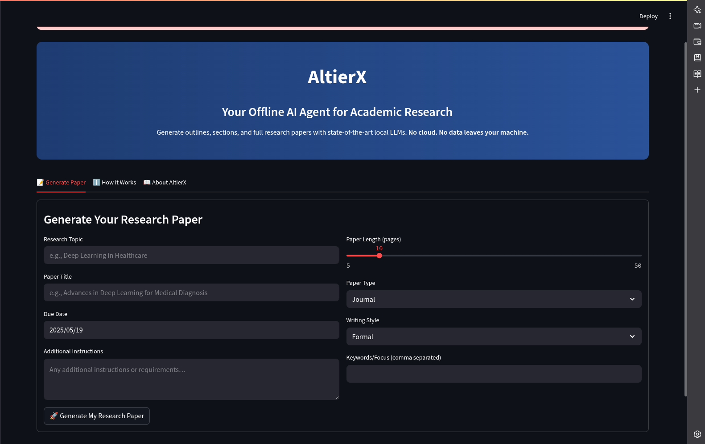
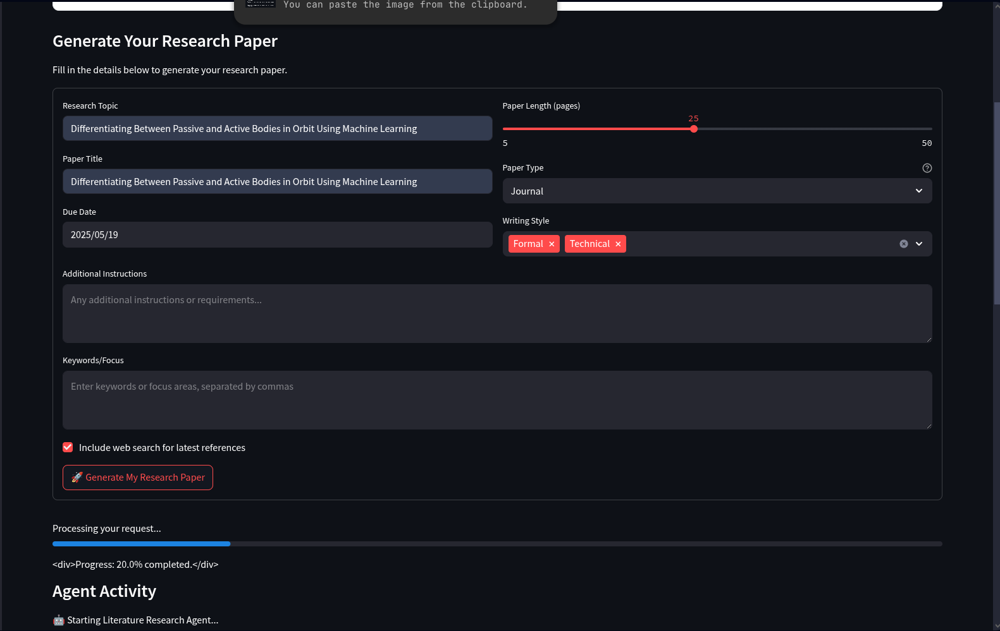
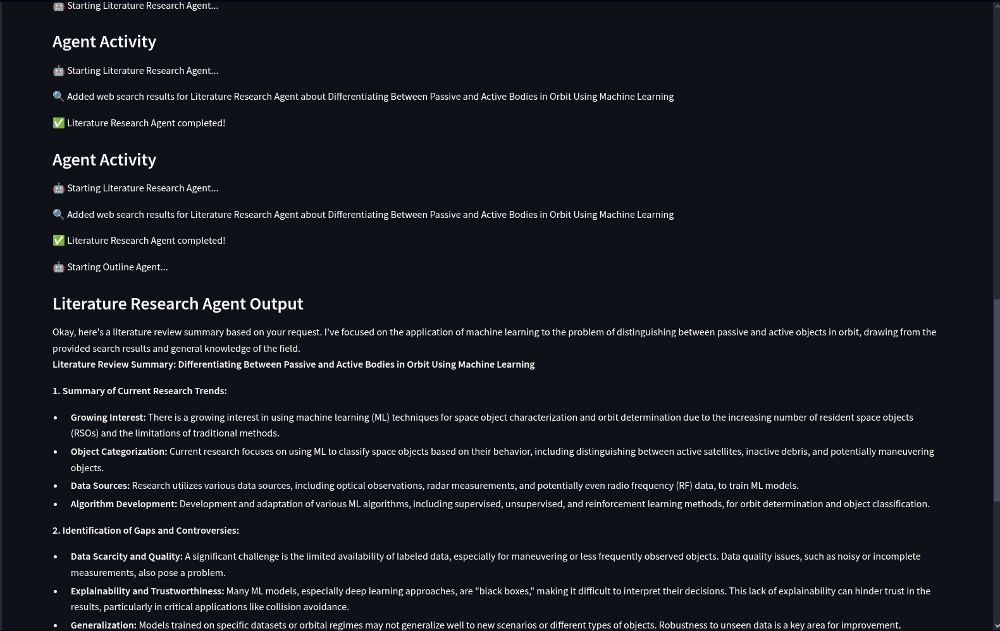
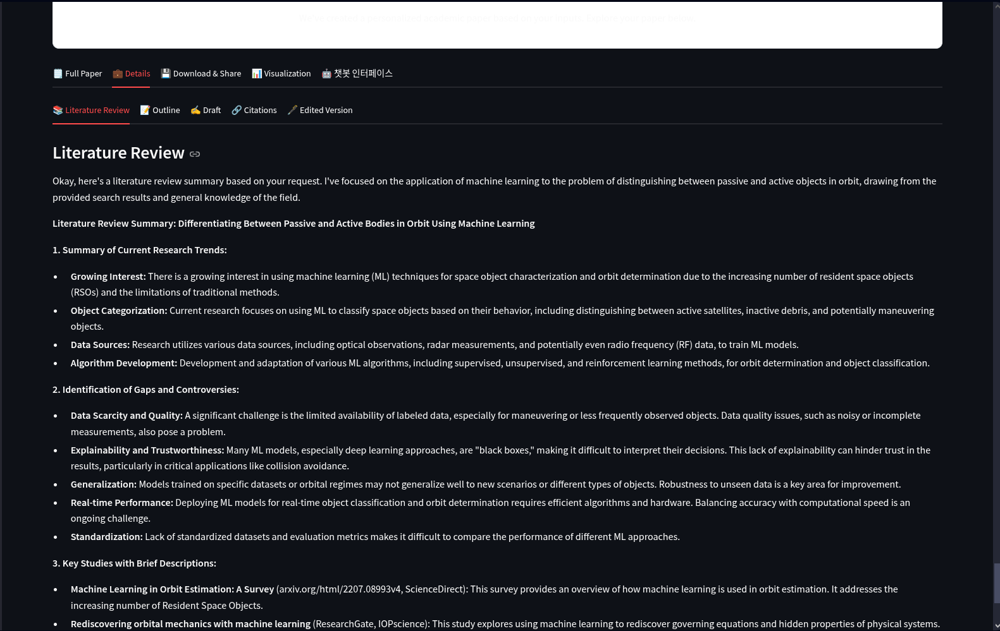

# AltierX

AltierX is a modern, AI-powered academic research assistant. Generate high-quality research papers, outlines, and literature reviews with ease using state-of-the-art language models—all **offline on your own machine**.

## Features
- Personalized research paper generation
- Academic outline and section drafting
- Literature review assistance
- Modern, user-friendly web interface (Streamlit)
- **Fully offline**: No data leaves your machine
- Uses local instruction-tuned LLMs (Mistral-7B-Instruct)

## Screenshots

### 🖥️ AltierX Dashboard

*The modern, offline-first dashboard with hero section and tabbed workflow.*

### 📝 Paper Generation Form (Filled)

*Fill in your research details, select paper type, style, and more.*

### 🤖 Agent Activity & Literature Review Output

*See real-time agent activity and detailed literature review output.*

### 📚 Literature Review Section

*Structured, academic literature review generated by AltierX.*

## Hardware Requirements
- **RAM:** 16GB minimum (32GB+ recommended)
- **VRAM:** 8GB+ (for GPU acceleration; otherwise runs on CPU **!!BAD IDEA**)
- **Disk:** ~15GB free (for model download)
- **OS:** Linux, macOS, or Windows

## Setup Instructions

1. Clone this repository
2. Install the required dependencies:
```bash
pip install -r requirements.txt
```
3. Download the model (first run will do this automatically, or you can pre-download with):
```bash
python -c "from transformers import AutoModelForCausalLM, AutoTokenizer; AutoTokenizer.from_pretrained('mistralai/Mistral-7B-Instruct-v0.2'); AutoModelForCausalLM.from_pretrained('mistralai/Mistral-7B-Instruct-v0.2')"
```
4. Run the Streamlit app:
```bash
streamlit run main.py
```

## Usage
1. Open the web interface in your browser
2. Fill in your research details
3. Generate and download your academic paper

## Notes
- **All computation is local.** No API keys or internet connection required after model download.
- If you have limited RAM/VRAM, consider using a smaller model (edit `local_backend.py` to change the model).
- For best results, use a machine with a modern GPU.

## Troubleshooting
- If you see out-of-memory errors, try closing other apps or use a smaller model.
- If you see model download errors, check your internet connection for the first run.
- For more help, see the [Transformers documentation](https://huggingface.co/docs/transformers/index).

## License
AltierX uses free Hugging Face models and is intended for research assistance only. Always review and verify the generated content. 
